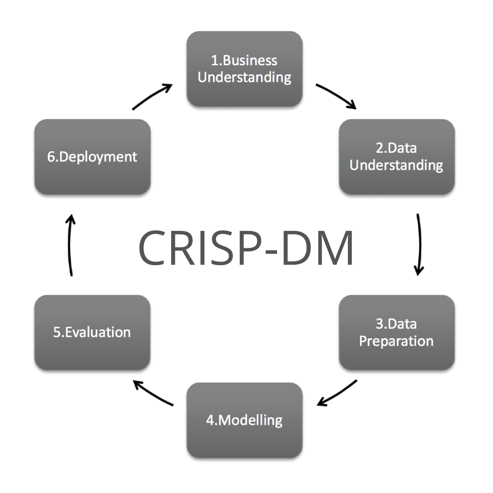
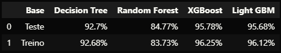
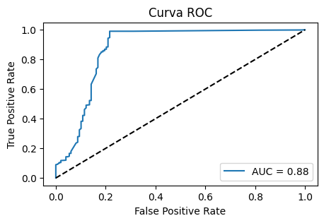

## Manufacturing Defects

O principal objetivo deste projeto é prever defeitos em máquinas para reduzir o downtime, melhorar a eficiência operacional e diminuir os custos de manutenção e produção. Neste projeto irei seguir o pipeline abaixo e tomar ações baseadas na metodologia CRISP-DM. A idéia central é aprender, portantto, irei executar o ciclo completo de um projeto tradicional de ciência de dados.

#### Pipeline

1. *Questão de negócio e Entendimento*: Identifiquei que as horas de manutenção têm uma correlação significativa com o status de defeitos das máquinas, sugerindo a necessidade de otimizar este aspecto para reduzir falhas.

2. *Coleta de dados*: Apesar dos dados estarem em um dataset no kaggle, já adiantei de criar um banco de dados local para fazer a conexão com o projeto.

3. *Limpeza dos dados e featuring engineering*: Não houve necessidade de limpeza dos dados, mas expandi o conjunto de variáveis de 17 para 30, criando novas features que proporcionaram um melhor entendimento do negócio. Este processo está documentado no arquivo eda.ipynb.

4. *Exploração dos dados*: A análise exploratória foi realizada e está detalhada no arquivo eda.ipynb, permitindo uma visão abrangente das variáveis e suas relações.

5. *Modelagem dos dados*: Utilizei o Standard Scaler para padronizar os dados numéricos, preparando-os para a etapa de modelagem.

6. *Algoritmos de machine learning*: Implementei e comparei vários algoritmos, incluindo Decision Tree, Random Forest, XGBoost e LightGBM.

7. *Avaliação do algoritmo*  O LightGBM destacou-se com uma acurácia de 95,88%, uma validação cruzada de 95,90%, e uma AUC de 0.88, indicando alta capacidade de discriminar entre máquinas com e sem defeitos. Detalhes adicionais e outras métricas estão documentados no arquivo train.ipynb.

Uma AUC de 0.88 significa que, em média, o modelo tem uma probabilidade de 88% de classificar corretamente um par aleatório de exemplos (um positivo e um negativo). Esse valor indica que o modelo tem uma alta capacidade de discriminar entre as classes de alto e baixo defeito.

8. *Modelo pronto para implementação*: O modelo final foi salvo em um arquivo .pkl, estando preparado para integração em uma API para uso prático em ambientes de produção.

### Conclusão

Em resumo, este projeto não só identificou os principais fatores que influenciam os defeitos nas máquinas, como também desenvolveu um modelo preditivo robusto, pronto para ser implementado e utilizado para melhorar a eficiência e reduzir custos operacionais na manutenção de máquinas.

