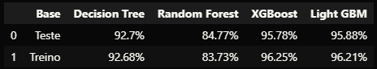

## Manufacturing Defects

O principal objetivo deste projeto é prever defeitos em máquinas para reduzir o downtime, melhorar a eficiência operacional e diminuir os custos de manutenção e produção. Neste projeto irei seguir o pipeline abaixo e tomar ações baseadas na metodologia CRISP-DM. A idéia central é aprender, portantto, irei executar o ciclo completo de um projeto tradicional de ciência de dados.

#### Pipeline

1. *Questão de negócio e Entendimento*: Nesta etapa, utilizarei uma metodologia ágil chamada Kanban, para documentar todos os processos.
2. *Coleta de dados*: Apesar dos dados estarem em um dataset no kaggle, já adiantei de criar um banco de dados local para fazer a conexão com o projeto.
3. *Limpeza dos dados e featuring engineering*: Não foi necessário fazer limpeza dos dados, mas foi feita a criação de diversas variáveis que ajudaram até no entendimento do negócio. Antes tinhamos 17 variáveis, agora temos 30, portanto nem todas serão usadas no modelo. No arquivo **eda.ipynb** consta todas as informações. Inclusive o 
4. *Exploração dos dados*: A análise exploratória foi feita e está no arquivo **eda.ipynb**.
5. *Modelagem dos dados*: No pré-processamento dos dados foi usado somente o Standard Scaler, pois nossas variáveis são numéricas.
6. *Algoritmos de machine learning*: Foram utilizados os algoritmos Decision Tree, Random Forest, XGBoost, LIght GBM. 
7. *Avaliação do algoritmo* o XGBoost teve a melhor acurácia, com *95,78%* e *931 acertos* contra *41 erros*, *validação cruzada: 95,99%*. Segue a tabela com os resultados dos algoritmos. Para resultados mais detalhados, estão documentadas todas as outras métricas no arquivo **train.ipynb**.

8. *Modelo pronto para implementação* (Em produção/Etapa Atual)

### Acompanhamento

Farei o acompanhamento deste projeto etapa por etapa, sem pular, para desenvolver o máximo de cada. Vou ficar sempre documentando, por isso, já ativa as notificações ai para me acompanhar. Ah, se quiser pode colaborar também, por isso fique a vontade para falar comigo no meu [LinkedIn](https://www.linkedin.com/in/juanvieira85/). 

